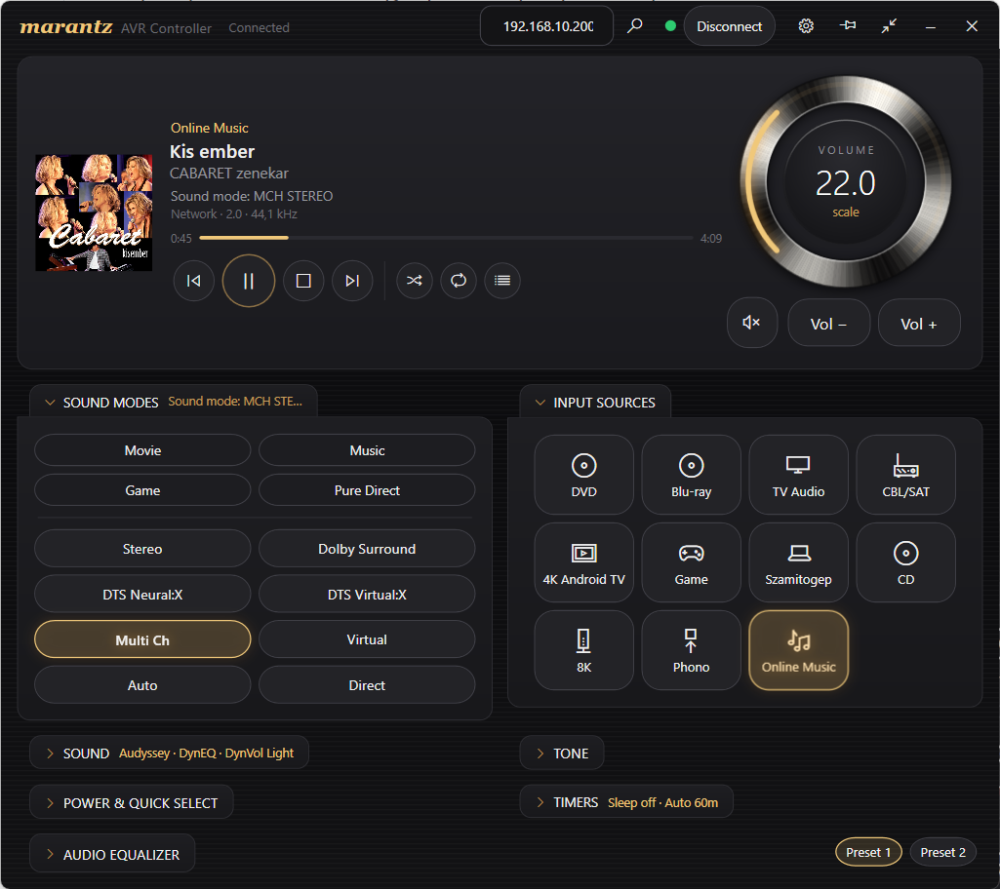
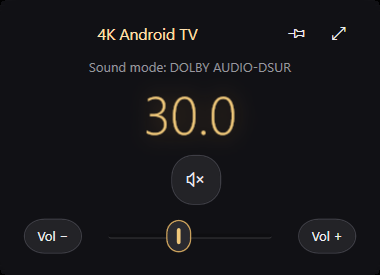

# Marantz Controller

A native Windows desktop remote for **Denon / Marantz AV receivers**, talking to the
receiver directly over your home network — no server, no Docker, no cloud account.



> **Unofficial project.** Not affiliated with, endorsed by or supported by Marantz,
> Denon, HEOS or Masimo. Product names are used only to describe compatibility.

## Features

- **Finds the receiver** on your network by itself (SSDP) — no need to look up its IP.
- **Live state** — the app reads the receiver's current state on connect and follows
  every change made from the remote, the front panel or the phone app.
- **Power, volume knob, mute**, sleep timer and auto-standby countdown.
- **Inputs** with the names you gave them on the receiver, and the four
  **Quick Select / Smart Select** memories.
- **Sound modes** and the **incoming signal** (Dolby / DTS / PCM, channel layout,
  sample rate), refreshed live while you switch audio tracks.
- **Audyssey** (MultEQ, Dynamic EQ, reference level, Dynamic Volume), tone controls,
  M-DAX and per-channel level trims with an EQ-style curve.
- **Subwoofer and LFE** levels; speaker size, crossover and bass-management settings
  in a separate Settings window.
- **HDMI monitor output switch** (Auto / Monitor 1 / Monitor 2) for TV + projector setups.
- **HEOS playback** — now playing with artwork, play/pause/skip, shuffle, repeat
  and the play queue.
- **Mini player** mode that stays out of the way (start it with `--mini`).
- Safety settings: volume limit, power-on volume, mute level.



## Compatibility

Developed and tested on a **Marantz SR5015**. Other Denon/Marantz receivers from
roughly 2016 onwards speak the same control protocol, so most features should work,
but some parameters differ between models. Options the receiver does not answer
for are hidden automatically. Reports from other models are very welcome — please
open an issue with the model name and what did or did not work.

## Receiver setup

1. Connect the receiver to the same network as your PC. A fixed IP / DHCP
   reservation is recommended.
2. To be able to power it on from the app, enable
   *Setup → Network → Network Control → Always On*.
3. The receiver accepts **only one telnet client at a time** (TCP port 23). Close
   other tools that use it while the app is connected.

## Download

Grab **`MarantzController-…-win-x64.exe`** from the
[latest release](https://github.com/Aluka77/marantz-controller/releases/latest) —
a single file, nothing to install. Windows 10/11, 64-bit.

The exe is not code-signed, so on first start SmartScreen may show
*"Windows protected your PC"*: click **More info → Run anyway**.
Every release is built from this repository's source by GitHub Actions.

## Build from source

Requirements: Windows 10/11 and the [.NET 10 SDK](https://dotnet.microsoft.com/download).

```bash
git clone https://github.com/<your-account>/marantz-controller.git
cd marantz-controller
dotnet run -c Release
```

On first start, press the **search** button next to the address box to find receivers
on your network (SSDP), or type the IP address yourself, then press **Connect**.
The address is remembered in `%APPDATA%\MarantzController\settings.json`.

If the search finds nothing, the receiver may be on another subnet or your network may
block multicast — look up its address in the receiver menu
(*Setup → Network → Information*) or in your router's device list.

## How it works

| Channel | Port | Used for |
|---|---|---|
| Denon/Marantz control protocol (telnet) | 23 | power, volume, inputs, sound modes, all audio parameters |
| HEOS CLI | 1255 | now playing, transport, shuffle/repeat, queue |

The code is plain WPF/MVVM with no external packages:

- `MarantzConnection.cs`, `HeosConnection.cs` — the two network clients
- `MainViewModel*.cs` — state, command parsing and the receiver option catalog
- `AvOptions.cs` — generic "pick a value" / "set a level" parameter model
- `MainWindow.xaml`, `SettingsWindow.xaml`, `Theme.xaml` — the UI
- `tools/avr_cli.py` — a tiny command-line tool for trying raw protocol commands

## Credits

- Receiver discovery follows the approach of
  [OxygenLack/Denon-Marantz-AVR-Dashboard](https://github.com/OxygenLack/Denon-Marantz-AVR-Dashboard) (MIT).
- Protocol tokens were cross-checked against
  [frawau/aiomadeavr](https://github.com/frawau/aiomadeavr).

## A word of caution

This app sends real commands to a real amplifier. Test with the volume down, and set
a **volume limit** in Settings before experimenting.

## License

[MIT](LICENSE)
